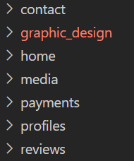
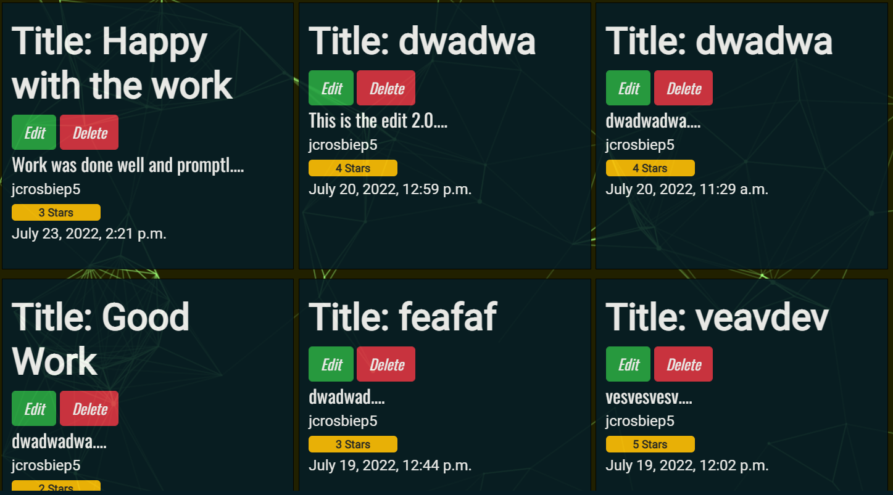
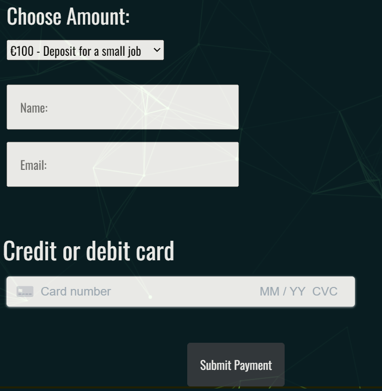
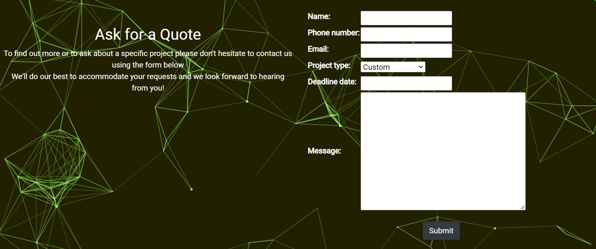
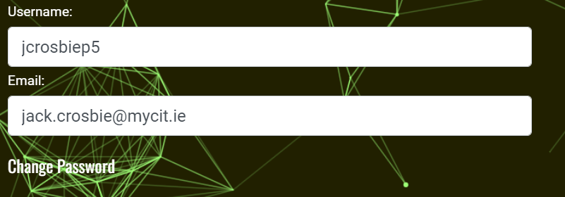
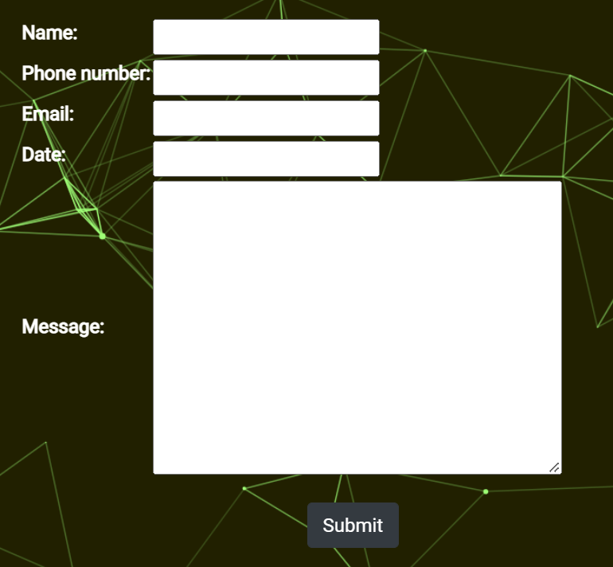
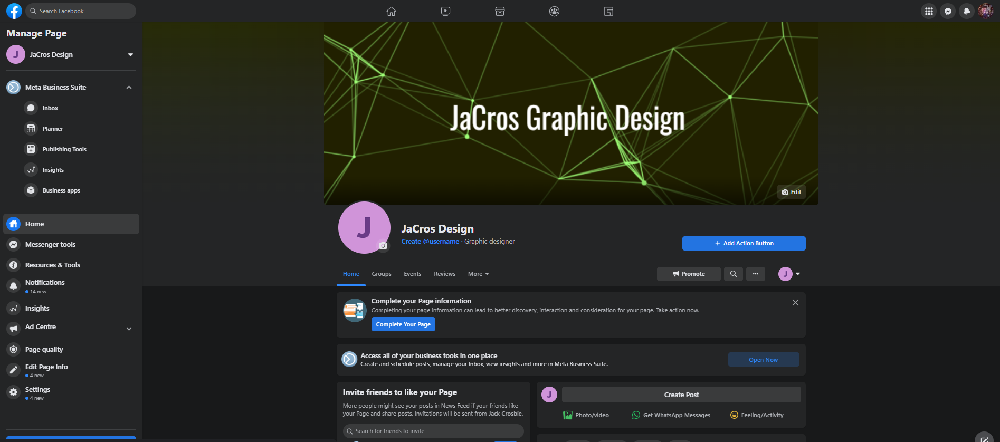
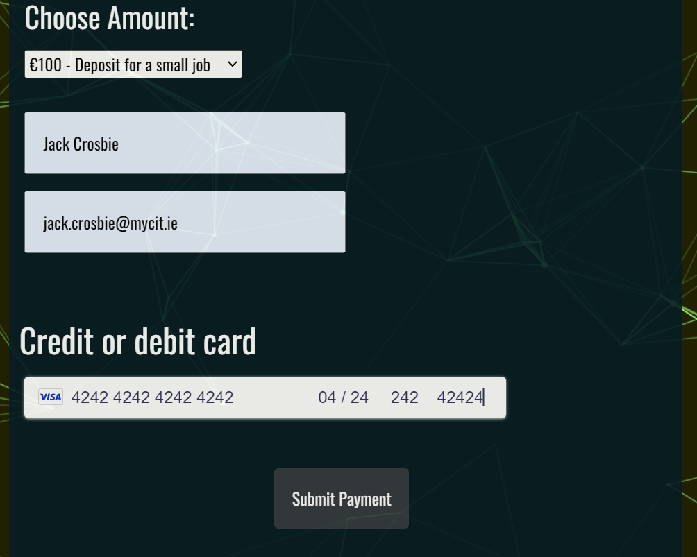

# Jacros Graphic Design

## Contents
- [Introduction](#introduction)
- [UX](#ux)
- [Technologies](#technologies)
- [Features](#features)
- [Testing](#testing)
- [Deployment](#deployment)
- [Credits](#credit)
- [Acknowledgements](#acknowledgements)

## Introduction
My submission for my P5, e-commerce applications, Project. This is a website offering my services as a graphic designer.
The website contains information about past projects I've worked on, a payment and quotes system, a review system where reviews can be edited and deleted by users and a newsletter sign up page. Information will be stored on a PostgreSQL database and will be able to be maintained and edited by the superuser.

### Demo

https://jacros-graphic-design.herokuapp.com/ - Live link to website!

## UX

Utilising UX design is essential these days to provide meaningful and relevant experiences to the user. To provide more balance and structure to my UX design I opted to use the five planes method to design and implement on my website.

### Strategy

**Vision**

The vision of the website is to show users past projects I have worked on and also giving them an easy and safe way to pay for my services.
By signing up to the newsletter users can stay uptodate with projects I'm working on and new skills I've acquired. Potential users can also read reviews left my previous customers to get a better understanding of what I can offer. 

**Aims**

1. Provide a stylish, easy to use and intuitive website.
2. Implement a payment service, using Stripe, which is safe and easy to use.
3. Create a contact form for information on jobs and requests from users.
4. Provide users with information on past projects
5. Enable users to Login/Logout, autofilling information when logged in to save time when leaving reviews or filling in quotes form.
6. Allow users to create, edit and delete reviews they have left.
7. Have a newsletter users can signup to to stay uptodate on jobs I'm working on and new skills I've acquired.

**User Stories**

- As a User I want a stylish looking well thoughout website so that i can find everything i want and access information easily
- As a Site Admin I want to be able to login to see orders so that i can maintain and manage customer purchases
- As a User I want to be able to log in and log out so that i can keep my information safe and see any products/services have i purchased
- As a User I want to be able to leave, update, delete and read reviews so that i read about previous customers experiences and leave my own experiences for other consumers
- As a User I want to be able to pay for good and services safely and securely so that i can not worry about my information being stolen
- As a User I want to be able to register so that i can log in when i return in future
- As a User I want to be able to request a quote so that i can get an understanding of costs before making a decision to buy
- As a User I want to see messages when logging in and logging out so that i can be sure the action was undertaken
- As a User I want to be able to change my password so that i can do so if the need arises and keep my account/information safe
- As a User I want to be able to contact the owner so that i can get specific information relevant to me
- As a User I want to see a professional looking homepage that will draw me in so that i can find out more information in an easy manner
- As a User I want to be able to easily navigate the site so that i can easily view all the content
- As a User I want a stylish looking well thoughout website so that i can find everything i want and access information easily

### Scope

Based on my user stories these are the features I felt needed implementing:

- Homepage/About page with information about who we are, what we do and previous projects worked on.
- A navigation bar to take you to the pages on the site
- Registration page so that customers could register
- Payments/quotes page so users can request quotes or pay for services through Stripe payments.
- Login and Logout, powered by Django AllAuth, so user could safely log in and out.
- Contact Us page, with form, so customers with special requests could get in touch
- A reviews page with full CRUD functionality
- A newsletter signup page so users can stay uptodate with projects I'm working on 

### Structure

The website is relatively simple in it's structure. Everything is clearly labeled and easily navigational so the user can get to what they need easily. All the major aspects of the website have their own page:
- Landing page with an animated logo
- About page to learn information about me
- Payments section split into two pages, one for making a payment and another for getting a quote.
- Members area for signing in or signing up and if signed in for seeing your account page or logging out.
- Contact us section split into two pages, one for sending a contact form and another for signing up to a newsletter.
- Reviews page for leaving, editing or deleting reviews.
- Navbar on each page to allow for easy navigation through the website.
- Footer containing social links at the bottom of each page

### Databases

I have three apps that require databases. They are contact app, payments app and reviews app.

These apps have customs models and forms to enable users to get in contact, sign up for a newletter, get a quote, make a payment and then full CRUD functionality on the reviews section.

#### Contact App

The contact app is split into two sections. One is for a contact from and the other for signing up to a newsletter.
The contact form has a custom model, and related form, which requires user to enter their name, email address, phone number, date and a textarea for leaving their message.
Users do not have to be registered to use this feature.

The newsletter form is a simpler version of the contact form. It only required users to input their name, phone number and email address in order to sign up for the newsletter.

The information from both forms is then sent to the database which can then me managed by the admin on the backend.

#### Payments App

The payments app also has two sections. One for getting a quote and another for making a payment.
The quote section has a custom model and form to enable the user to get a quote for a job/project.
The user is required to fill in their name, phone number, email address, a project type from a list of dropdown options, a deadline date and then a message box for all additional information. A unique quote id number is also generated and attached to the quote for ease of management for the admin.

The payments section is created using Stripe. It is made using custom JavaScript to handle the card payments and the overall submission of the payments form.
It is all linked to my Stripe account which deals with receiving payments. The views.py file contains the relevant views to handle the stripe payments form created by the JavaScript. There is also custom CSS to help with the styling of the payment form.

#### Reviews

The reviews app is where I implemented the CRUD functionality for my website.
In order to leave a review you must be registered and logged in.

The reviews app has a custom model which required users to input a title, the body of the review itself and then a rating between 1 and 5.
The user name and date of creation are automatically attached to the review. After a review has been left the user can edit or delete a review. They can only do this if the user id of the logged in user matched the user id of the user who created the review. This is to prevent other users deleting reviews they did not write. By enabling the user to be able to edit and delete their reviews after they have created them it gives the reviews app full CRUD functionality.

### Skeleton

[Wireframes for this project](assets/documents/p5-wireframes.pdf)

My wireframes were created using Balsamiq and represent the simplicity I was going for.

Using bootstrap I tried to give everything uniform and similar so the user would feel comfortable navigating around the site.
I tried to keep as close to my wireframes as possible when creating the various pages.

### Surface

I chose the green background with yellow running through it to make the website more interesting as it's execution was simple in nature. It helped make the pages standout without having to add too much content on each page.

The blue black color with white text for the navbar was chosen as I felt it stood out enough from the background image without being too much of a contrast and the text stood out well against that in the colour white.

## Technologies

The following is a list of the various technologies I used along with what they were used for:

- Django:
Django is the framework that has been used to build the over project and its apps.
- Python:
Python is the core programming language used to write all of the code in this application to make it fully functional.
- Bootstrap:
Used for creating responsive design.
- Stripe:
Stipe offers payment processing software and application programming interfaces (APIs) for e-commerce websites and mobile applications.
- AWS:
I used Amazon AWS S3 to store all of my media files.
- Google Fonts:
Used to obtain the fonts linked in the header, fonts used were Raleway and Lobster
- Font Awesome:
Used to obtain the icons used on the high scores and rules pages.
- Google Developer Tools:
Used as a primary method of fixing spacing issues, finding bugs, and testing responsiveness across the project.
- GitHub:
Used to store code for the project after being pushed.
- Git:
Used for version control by utilising the Gitpod terminal to commit to Git and Push to GitHub.
- Gitpod:
Used as the development environment.
- Heroku:
Used to deploy my application..
- Pep8:
Used to test my code for any issues or errors.
- Unicorn Revealer:
Used to detect overflow of elements, which allowed me to quickly debug any issues.
- W3C Markup Validation Service:
Used to validate all HTML code written and used in this webpage.
- W3C CSS Validation Service:
Used to validate all CSS code written and used in this webpage.
- PostgreSQL:
I have used Heroku's PostgreSQL relational database in deployment to store the data for my models.

## Features

**Features Implemented**

_As a User I want a stylish looking well thoughout website so that i can find everything i want and access information easily_

By providing a well designed and easily navigated website it improves the user satisfaction while using the website and also increases the likelyhood of them revisiting it. To make a well laid out website which was easily navigational I used general CSS styling and also Bootstrap for a more solid design.
I use a background image consistent throughout the entire website to keep each page uniform. With the background image taking up the entire background of the pages I only need to pick a couple colours which were for background of the navbar, background for text areas and colour for the text itself.
I opted for a black blue colour for the background of the navbar and text areas. This stood out against the green background without being too much of a contrast. For the text colour I simply went for a white colour as it stood out nicely against the green and black blue colours.
On the homepage I have used animate.css to create a bouncing effect on the logo 'JaCros Graphic Design'.

The website is broken down into the main componenets and each one of these has it's own page. They are all clearly marked and easily navigational to through the navbars. Every step is clearly marked and the styles are uniform through, like all the buttons are styled the same using bootstrap for a sense of familiarity throughout for the user. Through my choice of colours, images, use of bootstrap, HTML and CSS i feel the website i have created is both easy to navigate as well as stylish.

_As a Site Admin I want to be able to login to see orders so that i can maintain and manage customer purchases_

By registering a superuser who can access the admin panel It enables me to logon and maintain customer reviews, quotes, see whose signed up to the newsletter and people who have created profile and the relevant information associated with that profile (email address, username etc).

The management of payments will be done via logging onto my Stripe account. Here it keeps a summary of payments received with information such as amount of payment, name and email address of the person who made the payment.

_As a User I want to be able to register so that i can log in when i return in future_

A user will be able to register through the register button on the site, dropdown selection from the members link in the navbar. Once they fill out the registration form they will then be about to log in and log out in future. Authenication is provided by django AllAuth which keeps users and their information safe and secure.

_As a User I want to be able to log in and log out so that i can keep my information safe and see any products/services have i purchased_

If a user is registered they need the ability to login and logout of the website. This is a safety issue and stops someone else being able to use their account or access their information, if they were continually logged in. The login and logout ability was created through Django AllAuth.

_As a User I want to be able to leave, update, delete and read reviews so that i read about previous customers experiences and leave my own experiences for other consumers_

Once a user is logged in they can choose to leave a review about their customer experience and satisfaction level of the job provided. They can rate the service they got from 1 - 5. This enables future potential customers to get an understanding of the level of work I can provide for them. These reviews can be read by any user of the website regardless of whether they are a registered user or not. You have to be registered and logged in to leave a review though.
After leaving a review the user has the option to go back and edit or delete the review if they chose. Only the user who left the review can edit or delete that said review. This is stop users being able to edit or delete other users reviews. The edit/delete buttons only appear if the user id of the logged in user matches the user id of the user who left the review in the first instance.

_As a User I want to be able to pay for good and services safely and securely so that i can not worry about my information being stolen_

Using Stripe I was able to create a simple payment form which enables users to pay a set deposit dependant on the size of the job.
After setting up a Stripe account and then creating custom JavaScript and views to deal with the Stripe payment I now have a fully functioning, secure payments form on the site. The information is sent to my Stripe account and stored safely/securely there. A payment success message is shown once a payment has been successfully processed.

_As a User I want to be able to request a quote so that i can get an understanding of costs before making a decision to buy_

Through using the quote form a user is able to request a quote for a job while providing a more indepth description of the job needed. A unqiue quote id number is generated and sent to the admin panel. This is for ease of managing various quotes and gives a distinctive way of differentiating  between all the quotes/quote request. The rest of the information send by the form is straight forward and includes name, phone number, email and text area to input the information needed for the job.

_As a User I want to see messages when logging in and logging out so that i can be sure the action was undertaken_

When user are logging in and logging out it is beneficial for them to see a message stating the action has occured. Again this is a safety issue and just confirms the action was undertaken so the user can navigate away from the website knowing they have been logged out. This helps prevents users staying logged in if an error occurs as the user will be alerted.

By using bootstrap and toasts I was able to create login and logout success messages 

_As a User I want to be able to change my password so that i can do so if the need arises and keep my account/information safe_

A user may want to change their password if they have either forgotten their original one or was worried their information had been compromised.
Through using Django-AllAuth the user has the ability to change their old password from the My Profile tab in the Members Area.

_As a User I want to be able to contact the owner so that i can get specific information relevant to me_

Through using the contact form in the contact app A user is able to get in contact to request whatever extra information they might require before making a decision. This is different to the quote form which will only deal with information regarding a specific job request. The contact form can be used for whatever information they might require be it information on my schedule, past projects I've worked on, references etc.

_As a User I want to see a professional looking homepage that will draw me in so that i can find out more information in an easy manner_

By creating a simple landing page with a background image, animated logo and a navbar I feel i have created a nice looking homepage.
The animated logo also acts as a link to the about page which gives the user more information on who I am and what I do. The text colour works well against the background of the navbar and the background image. This makes everything clear and easily readable for the user.

_As a User I want to be able to easily navigate the site so that i can easily view all the content_

Through my navbar I feel I have make the website easy to navigate. The navbar is split into 6 sections Home, About, Payments, Members Area, Contact Us and Reviews.
Members Area, Payments and Contact Us are all dropdown links with additional relevant options e.g Payments is broken down into Make a Payment and Get a Quote.
I feel this was the most intuitive way to keep my website navigational while not overloading pages with information.

## Business Model

The business model for JaCros Design is a very simple B2C (Business to Customer) model.
To help with this model we have a straightforward easy to use interface.

Customers asks for a quote, receive a quote, respond in kind to the quote and can either say no and ends the interaction or agrees to the quote and proceeds with to pay a deposit for work to begin.
There is no middle man between the customer and the designer.

## Marketing

Through asking myself various questions, such as "what age profile would the users of the website be?", "what types of social media sites would they use?" and "What are the user's need?", along with my user stories and doing some research of other graphic design websites, I was able to ascertain that Facebook and Instagram would be my best methods of social media marketing. To start this process and to test out it's effective this I created a Facebook Business Page. 

This page could be updated with news, promotions or any other information and would enable me to reach a wider audience through Facebook.

Website users also have the option to sign up to the newsletter for further news, information and testimonies further increasing the brand awareness of JaCros Design.

## Testing

### Manual Testing

#### Homepage Logo

To test if the homepage logo was working as a link to the about page and that the animation attached to it was working as expected I reloaded my homepage.
I watched to make sure the bounce animation took effect. I saw this was working and then proceeded to click on the logo as it is meant to bring me to the About page. When i clicked the logo it took me to the about page as intended.

#### NavBar

To begin my testing I checked to ensure all the links on the navbar worked. I did this but clicking each link and ensuring it brought me to the desired location.
Each of the links on the navbar brought me to the correct page e.g the "reviews" link brought me to the reviews page as intended.
After this I ensured you could move between each page and back without any errors. I went through the links one at a time and make sure you could access each of the rest of the pages without any errors, crashes or bugs. I was able to navigate fully through the website without any issues.

#### Registration/Login/Logout

After testing the navbar to ensure everything was working I then decided to test the allauth registration and login.
I filled in the registration form and was able to create a new user. 

This all worked correctly and brought me to the relevant pages.
After my registration was complete I then checked I could log in as the newly created user. This again all worked as hoped so I was able to move on.

Next i tested the log out functionality was working. I clicked the log out button on the first navbar and was prompted to confirm I wanted to log out.
After confirming I wanted to log out I was logged out and no longer had access to the accounts page. This meant I couldn't see, edit or delete reviews made.
This was the outcome I had hoped for.

#### Payments Form

To ensure the payment form was working I navigated to make a payment page. Here i filled in the name and email address. I did inputted one of the trial Stripe card numbers.
After entering this and hitting submit I was redirected to the payment successful page. I then opened my Stripe account to ensure the "fake payment" had shown up. Once it had shown on my Stripe account I then knew the payments form was working.

#### Reviews

As the reviews have the CRUD functionality to my website I tested these last to make sure all was working as intended. I clicked on the reviews link in the navbar and was redirected to the reviews page. Here I could see some sample reviews I had created earlier. I clicked on "Leave a review" and was directed to log in. This was working as designed. Once I had signed in I could then leave a review.
After finshing the review I was brought back to the reviews page with the new review now there.
I decided to check the edit function was working first.
Intially I had an issue where the edit function was duplicating and original review and posting the new edit. I fixed this by removing the href url path on the edit review form in the html.
This prevent the reviews from being duplicated. Once I had fixed that I went about editing the original review I had left.
Once I was completed I clicked submit and was redirected to the reviews page which now correctly had the edited version of the review.
Finally I tested the delete function to ensure this work properly. I clicked on the review I had just edit and this time I hit delete. I was asked to confirm I wanted to delete that review.
Once I confirmed I was once again redirected to the reviews page and this time the review I had created was no longer there meaning the delete how worked successfully.
Finally I ensured I could not edit or delete reviews left by other users and once I confirmed this wasn't the case I finished the testing of the reviews section.

## Deployment

The master branch of this repository has been used for the deployed version of this application.

Using Github & Gitpod
To deploy my command-line interface application, I had to use the Code Institute Python Essentials Template, as this enables the application to be properly viewed on Heroku using a mock terminal.

- Click the Use This Template button.  
-  Add a repository name and brief description.
-  Click the Create Repository from Template to create your repository.
-  To create a Gitpod workspace you then need to click Gitpod, this can take a few minutes.
-  When you want to work on the project it is best to open the workspace from Gitpod (rather than Github) as this will open your previous workspace rather than creating a new one. You should pin the workspace so that it isn't deleted.
-  Committing your work should be done often and should have clear/explanatory messages, use the following commands to make your commits:
   -  git add .: adds all modified files to a staging area
   -  git commit -m "A message explaining your commit": commits all changes to a local repository.
   -  git push: pushes all your committed changes to your Github repository.

### Creating an Application with Heroku

I followed the below steps using the Code Institute tutorial:

- The following command in the Gitpod CLI will create the relevant files needed for Heroku to install your project dependencies pip3 freeze --local > requirements.txt. Please note this file should be added to a .gitignore file to prevent the file from being committed.
1. Go to Heroku.com and log in; if you do not already have an account then you will need to create one.
2. Click the New dropdown and select Create New App.
3. Enter a name for your new project, all Heroku apps need to have a unique name, you will be prompted if you need to change it.
4. Select the region you are working in.

Heroku Settings You will need to set your Environment Variables - this is a key step to ensuring your application is deployed properly.

- In the Settings tab, click on Reveal Config Vars and set the following variables:
  - If using credentials you will need to add the credentials as a variable, the key is the name 'CREDS' and the value is the contents of your creds JSON
  - Add key: PORT & value 8000
- Buildpacks are also required for proper deployment, simply click Add buildpack and search for the ones that you require.
  - For this project I needed to add Heroku Postgres.

Heroku Deployment In the Deploy tab:

- Connect your Heroku account to your Github Repository following these steps:
  - Click on the Deploy tab and choose Github-Connect to Github.
  - Enter the GitHub repository name and click on Search.
  - Choose the correct repository for your application and click on Connect.
- You can then choose to deploy the project manually or automatically, automatic deployment will generate a new application every time you push a change to Github, whereas manual deployment requires you to push the Deploy Branch button whenever you want a change made.
- Once you have chosen your deployment method and have clicked Deploy Branch your application will be built and you should see the below View button, click this to open your application:

## Credit

All the code used is entirely original and written by me. However I drew on resources such as Stack Overflow, django.docs, tutor support and Slack to fix various bugs and issues i encountered.

### Acknowledgements

As always I want to thank my mentor, Daisy McGirr for her fantastic advice, support and feedback throughout this project and beyond. I would also like to thank my peer Daisy Gunn for always being helpful, full of advice and willing to listen.
